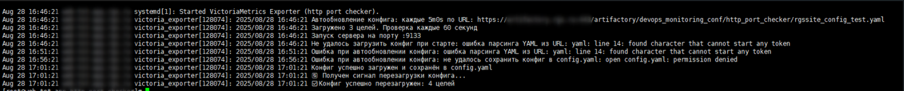

# Http port checker
Это exporter написанный на Go. Он проверяет доступность портов по http или выполняет http запрос для проверки доступности. И отдает метрики в формате Prometheus.


## Возможности
* Поддержка HTTP/HTTPS (игнорирует ошибки SSL)
* Поддержка доступности порта (tcp)
* Метрики в формате Prometheus
* Кросс-платформенность (Linux/Windows)
* Проверка по расписанию
* Таймауты в конфиге (глобальные и по целям)
* Детальные метрики: код ответа, размер тела (для http)
* Поддержка загрузки конфига по URL
* Автоматическое перечитывание конфига и применение без перезагрузки приложения (по URL)
* Поддержка аргументов
* Мультипоточность проверок

## Аргументы
| Параметр  | Описание |
| ------------- | ------------- |
|--config-url| Путь к конфигурационному файлу (default "config.yaml")|
|--config-refresh-minutes|Интервал обновления конфига из URL (в минутах) (default 60)|
|--config|URL для загрузки конфига (опционально)|
|--port|Порт, на котором будет слушать exporter (default 9133)|

## Пример конфига
```yaml
timeout_seconds: 10
check_interval_seconds: 30

targets:
  - name: "web_service_1"
    address: "http://httpbin.org/status/200"
    timeout_seconds: 5

  - name: "slow_site"
    address: "https://httpbin.org/delay/3"
    timeout_seconds: 10

  - name: "db_port_check"
    address: "localhost:5432"

  - name: "invalid_ssl"
    address: "https://self-signed.badssl.com"
```

## Пример работы


## Загрузка готовой сборки
Последняя версия всегда [тут](https://github.com/sx66627/vm_http_port_checker/releases/).  

## Сборка

Склонируйте репозиторий и в директории с исходником выполните команды ниже.

Выполните:
```bash
go mod tidy
```
Для загрузки зависимостей и генерации mod.sum

### Для Linux (systemd)
```bash
GOOS=linux GOARCH=amd64 go build -o victoria_exporter main.go
```

### Для Windows
```bash
GOOS=windows GOARCH=amd64 go build -o victoria_exporter.exe main.go
```
